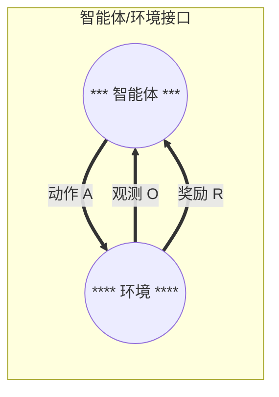
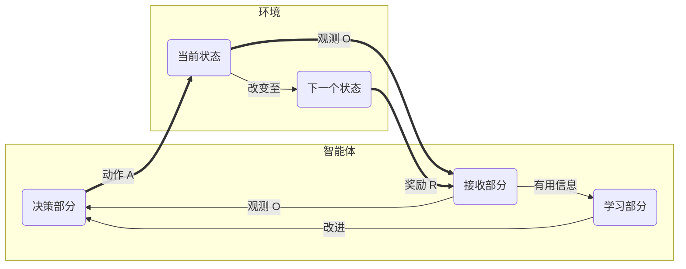
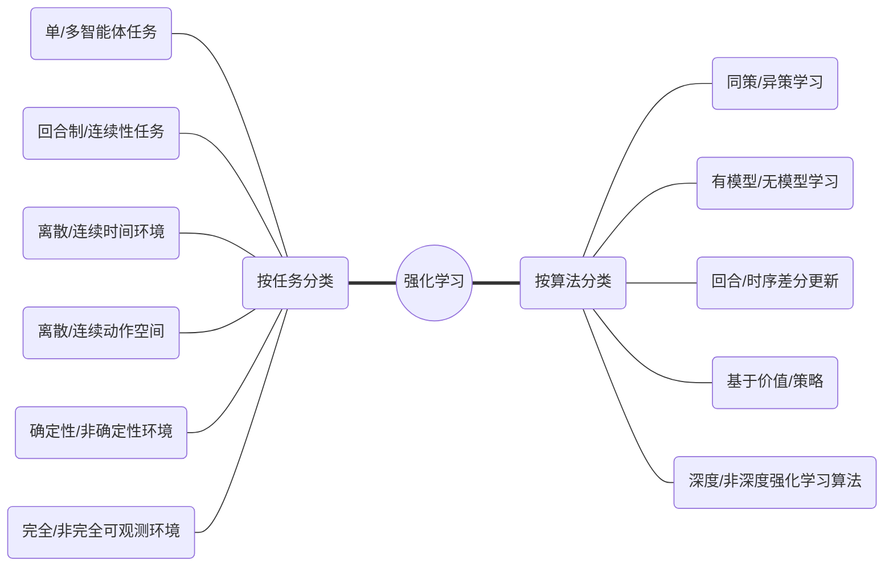

## 第一章：初识强化学习

### 一、强化学习的基本概念：

- **奖励（reward）：**奖励是强化学习系统的学习目标。智能体在采取行动后会收到环境发来的奖励，而强化学习的目标就是要最大化长时间里的总奖励。
- **策略（policy）：**策略为强化学习的学习对象。策略会指导智能体根据当前环境来采取动作，策略可以是确定性的，也可以是不确定性的（概率分布），强化学习通过改进策略来最大化总奖励。
- **智能体（agent）：**强化学习系统中的行动者和学习者，它可以做出决策和接受奖励信号，我们并不需要对智能体本身进行建模，只需了解它在不同环境下可以做出的动作，并接受奖励信号。
- **环境（environment）：**强化学习系统中除智能体以外的所有事物，它是智能体交互的对象。环境可以是已知的，也可以是未知的，因此可以对环境建模，也可以不对环境建模。

### 二、智能体和环境交互的过程：

*本人认为稍微具体点，可以展开如下：*

以上智能体/环境接口中，智能体和环境的交互主要有三个环节：
1. 智能体观测环境，可以获得环境的**观测（observation）**，一般记为 ***O***；
2. 智能体根据观测做出决策，决定要对环境施加的**动作（action）**，记为 ***A***；
3. 环境受智能体动作的影响，改变自己的**状态（state）**，记为 ***S***；并给出**奖励（reward）**，记为 ***R***

### 三、强化学习的分类：

**注：**同策学习（on-policy）是边决策边学习，学习者同时也是决策者。异策学习（off-policy）则是通过之前的历史（可是自己的也可以是别人的）进行学习，学习者和决策者不需要相同。

