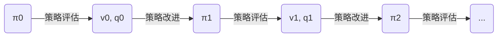

## 第三章：有模型数值迭代

对于实际问题，由于直接求解 Bellman 期望方程和 Bellman 最优方程往往有困难（例如需要极多的计算资源），本章在动力系统完全已知的情况下，用迭代的数值方法来求解。由于有模型迭代并没有从数据中学习，所以一般不认为是一种机器学习或强化学习方法。

### 一、度量空间与压缩映射

有模型策略迭代的理论基础：度量空间上的 Banach 不动点定理。下面简单介绍必要的概念，并证明 Bellman 算子是压缩映射，可以用 Banach 不动点定理迭代求解 Bellman 方程。

**度量**（mertic，又称距离），是定义在集合上的二元函数。对于集合 $\mathcal X$ ，其上的度量 $d: \mathcal X \times \mathcal X \rightarrow \Bbb R$ ，需满足：

- 非负性：对任意的 $x', x'' \in \mathcal X$ ，有 $d\left(x', x''\right) \ge 0$ ；
- 同一性：对任意的 $x', x'' \in \mathcal X$ ，如果 $d\left(x', x''\right) = 0$ ，则 $x'=x''$ ；
- 对称性：对任意的 $x', x'' \in \mathcal X$ ，有 $d\left(x', x''\right) = d\left(x'',x'\right)$ ；
- 三角不等式：对任意的 $x', x'', x''' \in \mathcal X$ ，有 $d\left(x', x'''\right) \le d\left(x', x''\right) + d\left(x'', x'''\right)$ ；

  *度量看起来与范数很像，但其本质是不一样的，参考资料：https://www.zhihu.com/question/42312263*

有序对 $(\mathcal X, d)$ 又称为**度量空间**（metric space）。考虑有限 Markov 决策过程状态函数 $v(s) \; (s \in \mathcal S)$ ，其中所有可能的取值组成集合 $\mathcal V = \Bbb R^{|\mathcal S|}$ ，定义 $d_\infty$ 如下 ：
$$
d_\infty \left(v',v''\right)=\max_{s \in \mathcal S} \; \big|v'\left(s\right)-v''\left(s\right)\big|
$$

可以证明 $d_\infty$ 是 $\mathcal V$ 上的一个度量。证明：显然满足非负性、同一性、对称性，而对于 $\forall s \in \mathcal S$ 有：

$$
\begin{split}
\big|v'\left(s\right)-v'''\left(s\right)\big| 
&= \big|\;[v'\left(s\right)-v''\left(s\right)] + [v''\left(s\right)-v'''\left(s\right)]\;\big| \\
&\le \big|\;v'\left(s\right) - v''\left(s\right)\;\big| + \big|\;v''\left(s\right)-v'''\left(s\right)\;\big| \\
&\le \max_{s \in \mathcal S} \; \big|v'\left(s\right) - v''\left(s\right)\big| + \max_{s \in \mathcal S} \; \big|v''\left(s\right) - v'''\left(s\right)\big|
\end{split}
$$

可得三角不等式，所以 $(\mathcal V, d_\infty)$ 是一个度量空间。

对于一个度量空间，如果 Cauchy 序列都收敛在该空间内，则称这个度量空间是**完备的**（complete）。例如，实数集 $\Bbb R$ 就是一个著名的完备空间（事实上实数集就是由完备性定义出来的。有理数集不完备，加上无理数集就完备了），对于 $(\mathcal V, d_\infty)$ 度量空间也是完备的（证明：略）。

对于一个度量空间 $(\mathcal X, d)$ 和其上的一个映射 $t:\mathcal X \rightarrow \mathcal X$ ，如果存在某个实数 $\gamma \in (0,1)$ ，使得对于任意的 $x', x'' \in \mathcal X$ ，都有 $d\left(\, t(x'), t(x'')\,\right) < \gamma\, d\left(x',x''\right)$ ，则称映射 $t$ 是**压缩映射**（contraction mapping，或 Lipschitzian mapping）。其中的实数 $\gamma$ 被称为 Lipschitzian 常数。而 Bellman 期望算子和 Bellman 最优算子 $t_*$ 是度量空间 $(\mathcal V, d_\infty)$ 上的压缩映射（证明：使用 $\eqref{eq:2} \eqref{eq:3}$ 代入到定义中使用不等式去证明，过程略）。

- 给定策略 $\pi\left(a \mid s\right) (s \in \mathcal S,a \in \mathcal A(s))$ 的 Bellman 期望算子 $t_\pi:\mathcal V \rightarrow \mathcal V$ ：

$$
t_\pi(v)(s) = \sum_a \pi\left(a \mid s \right) \left[r\left(s,a\right) + \gamma \sum_{s'}p\left(s' \mid s,a \right) v\left(s'\right)\right], \qquad s \in \mathcal S
\label{eq:2}
$$

- Bellman 最优算子 $t_*:\mathcal V \rightarrow \mathcal V$ ：

$$
t_*(v)(s) = \max_{a \in \mathcal A}\left[r\left(s,a\right) + \gamma \sum_{s' \in \mathcal S}p\left(s' \mid s,a \right) v_*\left(s'\right)\right], \qquad s \in \mathcal S
\label{eq:3}
$$

对于度量空间 $(\mathcal X, d)$ 上的映射 $t:\mathcal X \rightarrow \mathcal X$ ，如果 $x \in \mathcal X$ 使得 $t(x)=x$ ，则称 $x$ 是映射 $t$ 的**不动点**（fix point）。在完备度量空间上的压缩映射有非常重要的结论：**Banach 不动点定理**（Banach fixed-point theorem，又称压缩映射定理，compressed mapping theorem）。其内容为： $(\mathcal X, d)$ 是非空的完备度量空间， $t:\mathcal X \rightarrow \mathcal X$ 是一个压缩映射，则映射 $t$ 在 $\mathcal X$ 内有且仅有一个不动点 $x_{+\infty}$ 。

不动点的求取方法：从 $\mathcal X$ 内的任意一个元素 $x_0$ 开始，定义迭代序列 $x_k = t(x_{k-1}) \; (k=1,2,3,...)$ ，这个序列收敛，且极限为 $x_{+\infty}$ 。收敛证明：对于任意的 $k', k''$ 且 $k' < k''$ ，由三角不等式和非负性及压缩映射可知：
$$
\begin{split}
d\left(x_{k'},x_{k''}\right) &\le d\left(x_{k'},x_{k'+1}\right) + d\left(x_{k'+1},x_{k'+2}\right) + \cdots + d\left(x_{k''-1},x_{k''}\right) \\
&\le \sum_{k=k'}^{+\infty} d\left(x_{k+1},x_k\right) \\
&= \sum_{k=k'}^{+\infty} d\left(t\left(x_k\right),t\left(x_{k-1}\right)\right) \\
\text{（利用压缩映射）} &\le \sum_{k=k'}^{+\infty} \gamma d\left(x_{k},x_{k-1}\right) \\
\text{（反复利用压缩映射）} &\le \sum_{k=k'}^{+\infty} \gamma^k d\left(x_1,x_0\right) \\
&= \lim_{n \rightarrow +\infty} \frac{\gamma^{k'} \left(1-\gamma^n\right)}{1-\gamma} d\left(x_1,x_0\right)
\end{split}
$$
由于 $\gamma \in (0,1)$ ，所以上式不等式右端可以任意小，证毕。另外，在证明过程中可以看出迭代正比于 $\gamma^k$ 的速度收敛。

有了不动点的求取方法，那么就可以用该方法求 Bellman 期望算子和最优算子的不动点。其中 Bellman 期望算子的不动点是策略价值，对应于策略迭代算法；Bellman 最优算子的不动点是最有价值，对应于价值迭代算法。

### 二、有模型策略迭代

各种策略迭代算法中包含以下的三个概念：

- **策略评估（policy evaluation）：**对于给定的策略 $\pi$ ，估计策略的价值，包括动作价值和状态价值。

- **策略改进（policy improvement）：**对于给定的策略 $\pi$ ，在已知其价值函数的情况下，找到一个更优的策略。

- **策略迭代（policy iteration）：**综合利用策略评估和策略改进，找到最优策略。

对于策略评估，由于状态价值函数有 $|\mathcal S|$ 各自变量，而动作价值函数有 $|\mathcal S| \times |\mathcal A|$ 个自变量，因此选择使用状态价值函数作为迭代存储变量，以节约空间。策略评估在迭代中使用 Bellman 期望方程的表达式更新一轮所有状态的状态价值函数，这样对所有状态价值函数的一次更新又称为一次扫描。策略评估迭代算法有以下两种：
$$
\; \\ \; \\
\large \textbf{算法 3-1   有模型策略评估迭代算法} \\
\begin{split}
\rule[5pt]{10mm}{0.1em} &\rule[5pt]{265mm}{0.1em} \\
&\text{输入：动力系统 $p$ ，策略 $\pi$ 。} \\
&\text{输出：状态价值函数 $v_\pi$ 的估计值。} \\
&\text{参数：控制迭代次数的参数（例如容忍度误差 $\delta_{max}$ ，或最大迭代次数 $k_{max}$）。} \\
&\text{1.（初始化）对于 $s \in \mathcal S$ ，将 $v_0\left(s\right)$ 初始化为任意值（比如 0 ）。如果有终止状态，将终止状态初始化} \\
&\qquad \text{为 0 ，即 $v_0\left(s_{\text{终止}}\right) \leftarrow 0$ 。} \\
&\text{2.（迭代）对于 $k \leftarrow 0, 1, 2, 3, \cdots,$ 迭代执行以下步骤：} \\
&\qquad \text{2.1  对于 $s \in \mathcal S$ ，逐一更新 $v_{k+1}\left(s\right) \leftarrow \sum_a \pi \left(a \mid s \right) q_k\left(s,a\right)$ ，其中} \\
\end{split} \\

q_k\left(s,a\right) \leftarrow r\left(s,a\right) + \gamma \sum_{s'} p\left(s' \mid s, a\right) v_k\left(s'\right) \\

\begin{split}
&\qquad \qquad \;\, \text{2.2  若满足迭代终止条件（如对 $s \in \mathcal S$ 均有 $|v_{k+1}\left(s\right) - v_k\left(s\right)| \lt \delta_{max}$ ，或达到最大迭代次数} \\ 
&\qquad \qquad \qquad \; \text{$k=k_{max}$），则跳出循环。} \\
&\rule[-5pt]{275mm}{0.1em}
\end{split}
\; \\ \; \\
$$

事实上算法 3-1 没必要为每次扫描都重新分配一套空间 $v_k\;(k=0,1,2,...)$ 来存储，一种优化方法是，设置奇数次迭代的存储空间和偶数次迭代的存储空间，迭代更新时交换使用 $v_{odd} = f\left(v_{even}\right)$ 和 $v_{even} = f\left(v_{odd}\right)$ ，这样只需要两套存储空间就可以完成算法。

$$
\; \\ \; \\
\large \textbf{算法 3-2   有模型策略评估迭代算法（节省空间做法）} \\
\begin{split}
\rule[5pt]{10mm}{0.1em} &\rule[5pt]{265mm}{0.1em} \\
&\text{输入：动力系统 $p$ ，策略 $\pi$ 。} \\
&\text{输出：$v_\pi$ 的估计值。} \\
&\text{参数：控制迭代次数的参数（例如容忍度误差 $\delta_{max}$ ，或最大迭代次数 $k_{max}$）。} \\
&\text{1.（初始化）$v_0\left(s\right) \leftarrow$ 任意值 $s \in \mathcal S$。如果有终止状态，将终止状态初始化为 0 ，即 $v_0\left(s_{\text{终止}}\right) \leftarrow 0$ 。} \\
&\text{2.（迭代）对于 $k \leftarrow 0, 1, 2, 3, \cdots,$ 迭代执行以下步骤：} \\
&\qquad \text{2.1  对于使用误差容忍度的情况，初始化本次迭代观测到的最大误差 } \delta \leftarrow 0\ ; \\
&\qquad \text{2.2  对于 $s \in \mathcal S$ ：} \\ 
&\qquad \qquad \text{2.2.1  计算新状态价值 } v_{\text{新}} \leftarrow \sum_a \pi \left(a \mid s \right) \left[r\left(s,a\right) + \gamma \sum_{s'} p\left(s' \mid s, a\right) v\left(s'\right)\right]\ ; \\
&\qquad \qquad \text{2.2.2  对于使用误差容忍度的情况，更新本次迭代观测到的最大误差 } \delta \leftarrow \max \left(\delta,\ |v_{\text{新}} - v\left(s\right)|\right)\ ; \\
&\qquad \qquad \text{2.2.3  更新状态价值函数 } v\left(s\right) \leftarrow v_{\text{新}}\ ; \\
&\qquad \text{2.3  若满足迭代终止条件（如 $\delta \lt \delta_{max}$ 或达 $k=k_{max}$），则跳出循环。} \\
\rule[-5pt]{10mm}{0.1em} &\rule[-5pt]{265mm}{0.1em} \\
\end{split}
\; \\ \; \\
$$

算法 3-2 则只使用了一套存储空间，每次扫描时，他都及时更新状态价值函数。这样在更新后续的状态时，用来更新的状态价值函数有些在本次迭代中已经更新，有些在本次迭代中还没更新，所以，算法 3-2 的计算结果和算法 3-1 的计算结果不完全相同。不过，算法 3-2 在迭代次数不限的情况下也能收敛到状态价值函数。

对于策略改进，有**策略改进定理：**对于两个确定性的策略 $\pi$ 和 $\pi'$ ，如果

$$
v_\pi \le \sum_{a'} \pi'\left(a \mid s\right) q_\pi \left(s, a\right), \qquad s \in \mathcal S
\label{eq:4}
$$

则 $\pi \le \pi'$ ，即

$$
v_\pi \left(s\right) \le v_{\pi'} \left(s\right),\ s \in \mathcal S
\label{eq:5}
$$

在此基础上，若存在状态使得 $\eqref{eq:4}$ 的不等号是严格小于号，那么就存在状态使得 $\eqref{eq:5}$ 中的不等号也是严格小于号。（证明：略）

根据策略改进定理，对于确定性策略，若 $q_\pi\left(s,a\right) \gt v_\pi\left(s\right)$ ，那么就可以构造一个新策略 $\pi'$ ，该策略在状态 $s$ 做动作 $a$ ，而其他状态则与策略 $\pi$ 一致。这样的策略改进算法也有两个版本：
$$
\; \\ \; \\
\large \textbf{算法 3-3   有模型策略改进算法} \\
\begin{split}
\rule[5pt]{10mm}{0.1em} &\rule[5pt]{265mm}{0.1em} \\
&\text{输入：动力系统 $p$ ，策略 $\pi$ 及其状态价值函数 $v_\pi$。} \\
&\text{输出：改进的策略 $\pi'$ ，或策略 $\pi$ 已经达到最优的标志。} \\
&\text{1. 对于每个状态 $s \in \mathcal S$ ，执行以下步骤：} \\
&\qquad \text{1.1  为每个动作 $a \in \mathcal A$ ，求得动作价值函数 } q_\pi \left(s,a\right) \leftarrow r\left(s,a\right) + \gamma \sum_{s'} p\left(s' \mid s, a\right) v_\pi \left(s'\right)\ ;\\
&\qquad \text{1.2  找到使得 $q_\pi \left(s,a\right)$ 最大的动作 $a$ ，即 $\pi'\left(s\right)=\underset{a}{\arg\max}\; q\left(s,a\right)$ 。} \\
&\text{2. 对于新策略 $\pi'$ 和旧策略 $\pi$ 相同，则说明旧策略已是最优；否则，输出改进的新策略 $\pi'$。} \\
\rule[-5pt]{10mm}{0.1em} &\rule[-5pt]{265mm}{0.1em} \\
\end{split}
\; \\ \; \\
$$

算法 3-3 中，如果在后续不需要使用旧策略的情况下，可以不为新策略分配空间，由此就得到了算法 3-4 的版本。
$$
\; \\ \; \\
\large \textbf{算法 3-4   有模型策略改进算法（节约空间的做法）} \\
\begin{split}
\rule[5pt]{10mm}{0.1em} &\rule[5pt]{265mm}{0.1em} \\
&\text{输入：动力系统 $p$ ，策略 $\pi$ 及其状态价值函数 $v$。} \\
&\text{输出：改进的策略（任然存储为 $\pi$ ），或策略已经达到最优的标志 $o$。} \\
&\text{1. 初始化原策略是否为最优的标记 $o$ 为 True。} \\
&\text{2. 对于每个状态 $s \in \mathcal S$ ，执行以下步骤：} \\
&\qquad \text{2.1  为每个动作 $a \in \mathcal A$ ，求得动作价值函数 } q \left(s,a\right) \leftarrow r\left(s,a\right) + \gamma \sum_{s'} p\left(s' \mid s, a\right) v \left(s'\right)\ ;\\
&\qquad \text{2.2  找到使得 $q \left(s,a\right)$ 最大的动作 $a'$ ，即 $a'=\underset{a}{\arg\max}\; q\left(s,a\right)$ ;} \\
&\qquad \text{2.3  如果 $\pi \left(s\right) \neq a'$ ，则更新 $\pi \left(s\right) \leftarrow a'$ ， $o \leftarrow$ False 。}\\
\rule[-5pt]{10mm}{0.1em} &\rule[-5pt]{265mm}{0.1em} \\
\end{split}
\; \\ \; \\
$$
在了解策略评估和策略改进后，通过策略迭代综合利用两者来获得最优策略。策略迭代从一个任意的确定性策略 $\pi_0$ 开始，交替进行策略评估和策略改进，其基本步骤顺序如下图所示：



对于有限 Markov 决策过程，其确定性策略数是有限的，因此迭代过程中得到的策略序列一定能收敛。策略迭代算法的两个版本如下所示：
$$
\; \\ \; \\
\large \textbf{算法 3-5   有模型策略迭代} \\
\begin{split}
\rule[5pt]{10mm}{0.1em} &\rule[5pt]{265mm}{0.1em} \\
&\text{输入：动力系统 $p$ 。} \\
&\text{输出：最优策略。} \\
&\text{1.（初始化）将策略 $\pi_0$ 初始化为一个任意的确定性策略。} \\
&\text{2.（迭代）对于 $k \leftarrow 0, 1, 2, 3, \cdots$ ，执行以下步骤：} \\
&\qquad \text{2.1 （策略评估）使用策略评估算法，计算策略 $\pi_k$ 的状态价值函数 $v_{\pi_k}$ ;} \\
&\qquad \text{2.2 （策略更新）利用状态价值函数 $v_{\pi_k}$ 改进策略 $\pi_k$ ，得到改进的确定性策略 $\pi_{k+1}$ 。}  \\
&\qquad \qquad \text{如果 $\pi_k = \pi_{k+1}$（即对任意的 $s \in \mathcal S$ 均有 $\pi_k \left(s\right) = \pi_{k+1} \left(s\right)$ ），则迭代完成，} \\
&\qquad \qquad \text{返回策略 $\pi_k$ 为最终的最优策略。} \\
\rule[-5pt]{10mm}{0.1em} &\rule[-5pt]{265mm}{0.1em} \\
\end{split}
\; \\ \; \\
$$

同样为了节省空间，在各次迭代中用相同的空间 $v\left(s\right)（s \in \mathcal S）$ 来存储状态价值函数，用空间 $\pi\left(s\right)（s \in \mathcal S）$ 来存储确定性策略，即可得到策略迭代算法 3-6 的版本

$$
\; \\ \; \\
\large \textbf{算法 3-6   有模型策略迭代（节约空间的版本）} \\
\begin{split}
\rule[5pt]{10mm}{0.1em} &\rule[5pt]{265mm}{0.1em} \\
&\text{输入：动力系统 $p$ 。} \\
&\text{输出：最优策略 $\pi$ 。} \\
&\text{参数：策略评估需要的参数。} \\
&\text{1.（初始化）将策略 $\pi$ 初始化为一个任意的确定性策略。} \\
&\text{2.（迭代）迭代执行以下步骤：} \\
&\qquad \text{2.1 （策略评估）使用策略评估算法，计算策略 $\pi$ 的状态价值函数，存在 $v$ 中;} \\
&\qquad \text{2.2 （策略更新）利用 $v$ 中存储的状态价值函数进行策略改进，将改进的策略存储在 $\pi$ 。如果本次} \\
&\qquad \qquad \text{策略改进算法指示当前策略 $\pi$ 已经是最优策略，则迭代完成，返回策略 $\pi$ 为最终的最优策略。} \\
\rule[-5pt]{10mm}{0.1em} &\rule[-5pt]{265mm}{0.1em} \\
\end{split}
\; \\ \; \\
$$

### 三、有模型价值迭代

策略评估迭代算法利用 Bellman 期望方程迭代求解给定策略的价值函数，而价值迭代算法则是利用 Bellman 最优方程迭代求解最优策略的价值函数，并进而求得最优策略，其算法如下：
$$
\; \\ \; \\
\large \textbf{算法 3-7   有模型价值迭代算法} \\
\begin{split}
\rule[5pt]{10mm}{0.1em} &\rule[5pt]{265mm}{0.1em} \\
&\text{输入：动力系统 $p$ 。} \\
&\text{输出：最优策略估计 $\pi$ 。} \\
&\text{参数：策略评估需要的参数。} \\
&\text{1.（初始化）$v_0\left(s\right) \leftarrow$ 任意值，$s \in \mathcal S$。如果有终止状态，$v_0\left(s_{\text{终止}}\right) \leftarrow 0$ 。} \\
&\text{2.（迭代）对于 $k \leftarrow 0, 1, 2, 3, \cdots,$ 迭代执行以下步骤：} \\
&\qquad \text{2.1  对于 $s \in \mathcal S$ ，逐一更新 } v_{k+1}\left(s\right) \leftarrow \max_{a} \left(r\left(s,a\right) + \gamma \sum_{s'} p\left(s' \mid s, a\right) v_k\left(s'\right)\right) ; \\
&\qquad \text{2.2  若满足容忍度误差（即对 $s \in \mathcal S$ 均有 $|v_{k+1}\left(s\right) - v_k\left(s\right)| \lt \delta_{max}$ ），或达到最大迭代} \\
&\qquad \qquad \text{次数（即 $k=k_{max}$），则跳出循环。} \\
&\text{3.（策略）根据价值函数输出确定性策略 $\pi_*$ ，使得：} \\
\end{split} \\
\pi_* \left(s\right) \leftarrow \underset{a}{\arg\max} \left(r\left(s,a\right) + \gamma \sum_{s'} p\left(s' \mid s,a\right) v_{k+1}\left(s'\right)\right); \qquad s \in \mathcal S \\
\begin{split}
&\rule[-5pt]{10mm}{0.1em} &\rule[-5pt]{265mm}{0.1em} \\
\end{split}
\; \\ \; \\
$$
同样，价值迭代也可以在存储状态价值函数时重复使用空间，因此有以下版本的价值迭代算法：
$$
\; \\ \; \\
\large \textbf{算法 3-8   有模型价值迭代（节约空间版本）} \\
\begin{split}
\rule[5pt]{10mm}{0.1em} &\rule[5pt]{265mm}{0.1em} \\
&\text{输入：动力系统 $p$ 。} \\
&\text{输出：最优策略。} \\
&\text{参数：策略评估需要的参数。} \\
&\text{1.（初始化）$v_0\left(s\right) \leftarrow$ 任意值，$s \in \mathcal S$。如果有终止状态，$v_0\left(s_{\text{终止}}\right) \leftarrow 0$ 。} \\
&\text{2.（迭代）对于 $k \leftarrow 0, 1, 2, 3, \cdots,$ 迭代执行以下步骤：} \\
&\qquad \text{2.1  对于使用误差容忍度的情况，初始化本次迭代观测到的最大误差 } \delta \leftarrow 0\ ; \\
&\qquad \text{2.2  对于 $s \in \mathcal S$ 执行以下操作：} \\
&\qquad \qquad \text{2.2.1  计算新状态价值 } v_{\text{新}} \leftarrow \max_{a} \left(r\left(s,a\right) + \gamma \sum_{s'} p\left(s' \mid s, a\right) v\left(s'\right)\right) ; \\
&\qquad \qquad \text{2.2.2  对于使用容忍度误差的情况，更新本次迭代观测到的最大误差 } \delta \leftarrow \max \left(\;\delta,\; |v_{\text{新}} - v\left(s\right)|\;\right); \\
&\qquad \qquad \text{2.2.3  更新状态价值函数 } v\left(s\right) \leftarrow v_{\text{新}}\;; \\
&\qquad \text{2.3  若满足容忍度误差（即 $\delta \lt \delta_{max}$ ），或达到最大迭代次数（即 $k=k_{max}$），则跳出循环。} \\
&\text{3.（策略）根据价值函数输出确定性策略：} \\
\end{split} \\
\pi \left(s\right) \leftarrow \underset{a}{\arg\max} \left(r\left(s,a\right) + \gamma \sum_{s'} p\left(s' \mid s,a\right) v\left(s'\right)\right) 。\\
\begin{split}
&\rule[-5pt]{10mm}{0.1em} &\rule[-5pt]{265mm}{0.1em} \\
\end{split}
\; \\ \; \\
$$

### 四、案例：冰面滑行（FrozenLake-v0）

使用 gym 库中的冰面滑行问题（FrozenLake-v0）作为案例分析，该环境也是一个有限 Markov 决策过程，具体环境和规则可查看[源代码][1]。书上的源代码是使用算法 3-2 实现策略评估算法，使用算法 3-4 实现策略改进算法，使用算法 3-6 实现策略迭代算法来获取最优策略及其状态价值函数。

根据书上的源代码，将其改写成了一个类 `PolicyIteration` ，为了方便研究整个评估和改进过程，将动作价值函数 $q(s,a)$ 也存储了下来，所以策略改进部分没有严格按算法实现，并且并综合修改了其他模块的部分语句，改写的代码如下：

```python
class PolicyIteration():
    def __init__(self, env, gamma=0.99, tolerant=1e-6):
        self.env = env
        self.gamma = gamma
        self.tolerant = tolerant
        self.policy = np.ones((env.observation_space.n, env.action_space.n)) / env.action_space.n
        self.v_table = np.zeros(env.observation_space.n)
        self.q_table = np.zeros((env.observation_space.n, env.action_space.n))
        self.policy_is_optimal = False

    def v2q(self, single_state=None):
        if single_state is not None:
            q_line = np.zeros(self.env.action_space.n)
            for action in range(self.env.action_space.n):
                for proba, next_state, reward, done in self.env.P[single_state][action]:
                    q_line[action] += proba * (reward + self.gamma * self.v_table[next_state] * (1.0 - done))
            return q_line
        else:
            for state in range(self.env.observation_space.n):
                self.q_table[state] = self.v2q(state)

    def evaluate_policy(self):
        self.v_table[:] = 0
        while True:
            delta = 0
            for state in range(self.env.observation_space.n):
                v_new = sum(self.policy[state] * self.v2q(state))
                delta = max(delta, abs(self.v_table[state]-v_new))
                self.v_table[state] = v_new
            if delta < self.tolerant:
                break

    def improve_policy(self):
        self.v2q()
        actions = np.argmax(self.q_table, axis=1)
        policy = np.eye(self.env.observation_space.n, \
                self.env.action_space.n)[actions]
        if (self.policy == policy).all():
            self.policy_is_optimal = True
        else:
            self.policy = policy

    def iterate_policy(self):
        while True:
            self.evaluate_policy()
            self.improve_policy()
            if self.policy_is_optimal:
                break
```

对于该案例也可以使用价值迭代算法去求解最优策略，书上的源代码是使用算法 3-8 实现的价值迭代算法，同样的，也将其改写成了一个类 `ValueIteration` ，并且记录了动作价值函数  $q(s,a)$ ，改写的代码如下：

```python
class ValueIteration():
    def __init__(self, env, gamma=0.99, tolerant=1e-6):
        self.env = env
        self.gamma = gamma
        self.tolerant = tolerant
        self.v_table = np.zeros(env.observation_space.n)
        self.q_table = np.zeros((env.observation_space.n, env.action_space.n))

    def v2q(self, single_state=None):
        if single_state is not None:
            q_line = np.zeros(self.env.action_space.n)
            for action in range(self.env.action_space.n):
                for proba, next_state, reward, done in self.env.P[single_state][action]:
                    q_line[action] += proba * (reward + self.gamma * self.v_table[next_state] * (1.0 - done))
            return q_line
        else:
            for state in range(self.env.observation_space.n):
                self.q_table[state] = self.v2q(state)

    def iterate_value(self):
        while True:
            delta = 0
            for state in range(self.env.observation_space.n):
                v_max = max(self.v2q(state))
                delta = max(delta, abs(self.v_table[state]-v_max))
                self.v_table[state] = v_max
            if delta < self.tolerant:
                break
        self.v2q()
        actions = np.argmax(self.q_table, axis=1)
        self.policy = np.eye(self.env.observation_space.n, \
                self.env.action_space.n)[actions]
```

[1]: https://github.com/openai/gym/blob/master/gym/envs/toy_text/frozen_lake.py	"FrozenLake-v0"